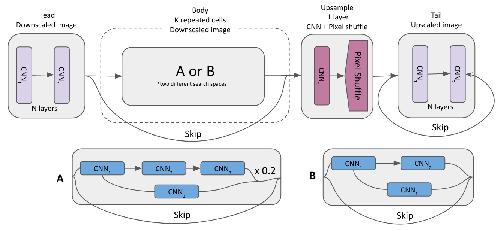

## code for the paper "QuantNAS for super resolution: searching for efficient quantization-friendly architectures against quantization noise.
### dev name "QuanTOAStER - Quantization Optimal Architechture Searcher"

### Full precision NAS VS Joint quantization:
To search with different bit-widths set desired bit-widths in "configs/fp_config.yaml" <br>
<br>
Examples:  <br>
1. arch.bits = [8,4,2] will perform mixed precision search for all specified bit-widths. <br>
2. arch.bits = [32] will perform full precision search. <br>
3. arch.bits = [32,4] will perform mixed precision search for all specified bit-widths, proper relu activations for 32 bit-widths will be used. <br>


<br>
<br>

## Batch experiments: <br>
To run experiment with different penalty and seed use "batch_exp.py" and edit **"./configs/fp_config.yaml or quant_config.yaml"**.

Example:
```
python3 batch_exp.py -v 0.0001 0.001 0.005 0.01 -d experiment_name -r 1 -g 3 -c quant_config.yaml
 
-d Experiment name 
-r Number of runs 
-g Gpu number 
-v Values for harware penalties
-c config for quantization or full precision NAS:  quant_config.yaml or fp_config.yaml, some hyperparameters are different.
```
This script will run search, train and validate final models.

<br>

## If you want to run architecture search or train selected model separately you can run "search_sr.py" and "augment_sr.py" manually.

#### 1. **search_sr.py**. - to run architecture search without final training. 

Usage example: ```python search_sr.py```

Don't forget to edit **"./configs/fp_config.yaml"**. "train" field can be skipped.

After script execution best architechture will be saved in best_arch.gen and you can pass it to augment_sr.py to train found architechture from scratch.

#### 2. **augment_sr.py** - to train final architecture.

Usage example: ```python augment_sr.py```

Don't forget to edit **"./configs/fp_config.yaml"**. "search" field can be skipped.
Specify **train.genotype_path** to pass architectures genotype. Genotype example: 
```
Genotype_SR(
    head=[('simple_5x5_grouped_3', 8), ('simple_3x3', 8)], 
    body=[('simple_1x1_grouped_3', 2), ('simple_1x1', 2)], 
    tail=[], 
    skip=[('decenc_3x3_2', 2)], 
    upsample=[('simple_3x3_grouped_3', 8)]
)
```

 

## Search space can be modified:


### 1. First, supernet is build according to **arch_pattern**.
You can specify it by editing "configs/sr_config.yaml".
General sceme looks like this:


Example of a scheme above with B body type:
*tail can be set as 0, other parts can not be skipped.

```
arch:
  arch_pattern: # the number of blocks of different types
      head: 2
      skip: 1
      tail: 2
      body: 2
      upsample: 1
  body_cells: 3

```

### 2. Edit **genotypes.py** or config files to define possible operations for each block type. 
```
.   .   .
skip = [
    "decenc_3x3_2",
    "decenc_5x5_2",
    "simple_3x3",
    "simple_5x5",
]

PRIMITIVES_SR = {
    "head": head,
    "body": body,
    "skip": skip,
    "tail": tail,
    "upsample": upsample,
}
.   .   .
```

### Train dataset
1. download DIV2K from the original website https://data.vision.ee.ethz.ch/cvl/DIV2K/, only original high resolution images are needed.
2. set path to image folder in ./prep/config.yaml
3. run ./prep/make_set.py

### Validation datasets
For validation sets download Set14 & Set5 and set according paths in ./sr_models/valsets4x.yaml. Validation will be performed on all the datasets specified in ./sr_models/valsets4x.yaml.
